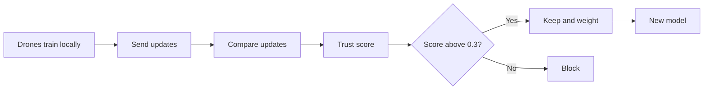

Testing whether Mermaid diagrams render.

```mermaid
flowchart LR
    A[Drones train locally] --> B[Send updates]
    B --> C[Compare updates]
    C --> D[Trust score]
    D --> E{Score above 0.3?}
    E -- Yes --> F[Keep and weight]
    E -- No --> G[Block]
    F --> H[New model]
```

If you can see a flowchart above, Mermaid is working.
